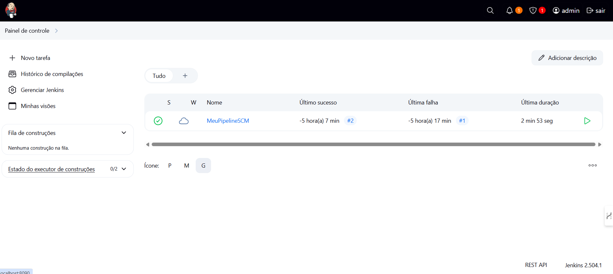
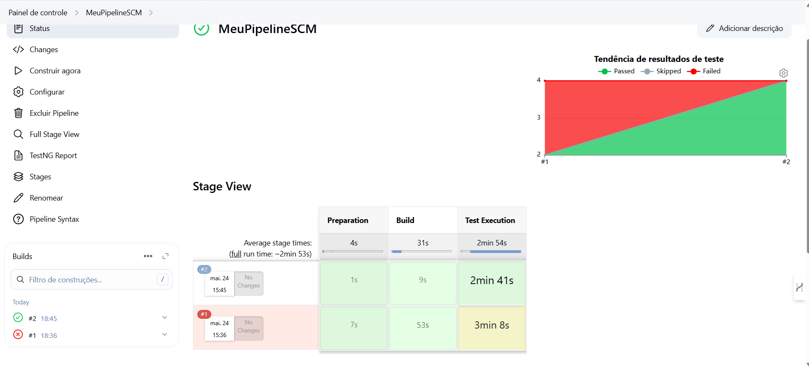

# Project to demonstrate knowledge in tools such as Selenium + Java + TestNg + Docker + Grid (Parallel Testing) + Jenkins + Docker

Don't forget to give this project a ⭐

It has a complete solution to run tests in different ways:

* local testing using the browser on your local machine
* Distributed execution using Selenium Grid (running in parallel)

This project uses the following languages and frameworks:

* [Java 17](https://openjdk.java.net/projects/jdk/23/) as the programming language (Here could also be 23 version, but I'm using 17 to be well integrated with the last image's version from Jenkins for Docker)
* [TestNG](https://testng.org/doc/) as the UnitTest framework to support the test creation
* [Selenium WebDriver](https://www.selenium.dev/) as the web browser automation framework using the Java binding
* [AssertJ](https://joel-costigliola.github.io/assertj/) as the fluent assertion library
* [Allure Report](https://docs.qameta.io/allure/) as the testing report strategy
* [DataFaker](https://www.datafaker.net/) as the faker data generation strategy
* [Log4J2](https://logging.apache.org/log4j/2.x/) as the logging management strategy
* [Owner](http://owner.aeonbits.org/) to minimize the code to handle the properties file
* [TestContainers](https://java.testcontainers.org/modules/webdriver_containers/) Webdriver Containers

## Test architecture

We know that any automation project starts with a good test architecture.

This project can be your initial test architecture for a faster start.
You will see the following items in this architecture:

* [Page Objects pattern](#page-objects-pattern)
* [Execution types](#execution-types)
* [BaseTest](#basetest)
* [TestListener](#testlistener)
* [Logging](#logging)
* [Configuration files](#configuration-files)
* [Parallel execution](#parallel-execution)
* [Test Data Factory](#test-data-factory)
* [Profiles executors on pom.xml](#profiles-executors-on-pomxml)
* [Pipeline as a code](#pipeline-as-a-code)
* [Test environment abstraction](#execution-with-docker-selenium-distributed)

Do you have any other items to add to this test architecture? Please do a pull request or open an issue to discuss.

### Page Objects pattern

I will not explain the Page Object pattern because you can find a lot of good explanations and examples on the internet.
Instead, I will explain what exactly about page objects I'm using in this project.

#### AbstractPageObject

This class has a protected constructor to remove the necessity to init the elements using the Page Factory.
Also, it sets the timeout from the `timeout` property value located on `general.properties` file.

All the Page Object classes should extend the `AbstractPageObject`.
It also tries to remove the `driver` object from the Page Object class as much as possible.

### Execution types

There are different execution types:

- `local`
- `local-suite`
- `selenium-grid`
- `testcontainers`

The `TargetFactory` class will resolve the target execution based on the `target` property value located
on `general.properties` file. Its usage is placed on the `BaseWeb` class before each test execution.

#### Local execution

##### Local machine

**This approach is automatically used when you run the test class in your IDE.**

When the `target` is `local` the `createLocalDriver()` method is used from the `BrowserFactory` class to return the
browser instance.

The browser used in the test is placed on the `browser` property in the `general.properties` file.

##### Local Suite

It's the same as the Local Execution, where the difference is that the browser is taken from the TestNG suite file
instead of the `general.properties`
file, enabling you to run multi-browser test approach locally.

##### Testcontainers

This execution type uses the [WebDriver Containers](https://www.testcontainers.org/modules/webdriver_containers/) in
Testcontainers to run the tests in your machine, but using the Selenium docker images for Chrome or Firefox.

When the `target` is `testcontainers` the `TargetFactory` uses the `createTestContainersInstance()` method to initialize
the container based on the browser set in the `browser` property. Currently, Testcontainers only supports Chrome and
Firefox.

Example

```shell
mvn test -Pweb-execution -Dtarget=testcontainers -Dbrowser=chrome
```

#### Remote execution

##### Selenium Grid

The Selenium Grid approach executes the tests in remote machines (local or remote/cloud grid).
When the `target` is `selenium-grid` the `getOptions` method is used from the `BrowserFactory` to return the browser
option
class as the remote execution needs the browser capability.

The `DriverFactory` class has an internal method `createRemoteInstance` to return a `RemoteWebDriver` instance based on
the browser capability.

You must pay attention to the two required information regarding the remote execution: the `grid.url` and `grid.port`
property values on the `grid.properties` file. You must update these values before the start.

If you are using the `docker-compose.yml` file to start the Docker Selenium grid, the values on the `grid.properties`
file should work.

You can take a look at the [Execution with Docker Selenium Distributed](#execution-with-docker-selenium-distributed)
to run the parallel tests using this example.

#### BrowserFactory class

This Factory class is a Java enum that has all implemented browsers to use during the test execution.
Each browser is an `enum`, and each enum implements four methods:

* `createLocalDriver()`: creates the browser instance for the local execution. The browser driver is automatically
  managed by the WebDriverManager library
* `createDriver()`: creates the browser instance for the remote execution
* `getOptions()`: creates a new browser `Options` setting some specific configurations, and it's used for the remote
  executions using the Selenium Grid
* `createTestContainerDriver()` : Creates selenium grid lightweight test container in Standalone mode with
  Chrome/Firefox/Edge browser support.

You can see that the `createLocalDriver()` method use the `getOptions()` to get specific browser configurations, as
starting the browser maximized and others.

The `getOptions()` is also used for the remote execution as it is a subclass of the `AbstractDriverOptions` and can be
automatically accepted as either a `Capabilities` or `MutableCapabilities` class, which is required by
the `RemoteWebDriver` class.

#### DriverManager class

The
class [DriverManager](https://github.com/eliasnogueira/selenium-java-lean-test-achitecture/blob/master/src/main/java/com/eliasnogueira/driver/DriverManager.java)
create a `ThreadLocal` for the WebDriver instance, to make sure there's no conflict when we run it in parallel.

### BaseTest

This testing pattern was implemented on
the [BaseWeb](https://github.com/eliasnogueira/selenium-java-lean-test-achitecture/blob/master/src/test/java/com/eliasnogueira/BaseWeb.java)
class to automatically run the pre (setup) and post (teardown) conditions.

The pre-condition uses `@BeforeMethod` from TestNG creates the browser instance based on the values passed either local
or remote execution.
The post-condition uses `@AfterMethod` to close the browser instance.
Both have the `alwaysRun` parameter as `true` to force the run on a pipeline.

Pay attention that it was designed to open a browser instance to each `@Test` located in the test class.

This class also has the `TestListener` annotation which is a custom TestNG listener, and will be described in the next
section.

### TestListener

The `TestListener` is a class that
implements [ITestListener](https://testng.org/doc/documentation-main.html#logging-listeners).
The following method is used to help logging errors and attach additional information to the test report:

* `onTestStart`: add the browser information to the test report
* `onTestFailure`: log the exceptions and add a screenshot to the test report
* `onTestSkipped`: add the skipped test to the log

### Logging

All the log is done by the Log4J using the `@Log4j2` annotation.

The `log4j2.properties` has two strategies: console and file.
A file with all the log information will be automatically created on the user folder with `test_automation.log`
filename.
If you want to change it, update the `appender.file.fileName` property value.

The `log.error` is used to log all the exceptions this architecture might throw. Use `log.info` or `log.debug` to log
important information.

### Parallel execution

The parallel test execution is based on
the [parallel tests](https://testng.org/doc/documentation-main.html#parallel-tests)
feature on TestNG. This is used by `selenium-grid.xml` test suite file which has the `parallel="tests"` attribute and
value,
whereas `test` item inside the test suite will execute in parallel.
The browser in use for each `test` should be defined by a parameter, like:

```xml

<parameter name="browser" value="chrome"/>
```

You can define any parallel strategy.

It can be an excellent combination together with the grid strategy.

#### Execution with Docker Selenium Distributed

This project has the `docker-compose.yml` file to run the tests in a parallel way using Docker Selenium.
To be able to run it in parallel the file has
the [Dynamic Grid Implementation](https://github.com/SeleniumHQ/docker-selenium#dynamic-grid-) that will start the
container on demand.

This means that Docker Selenium will start a container test for a targeting browser.

```shell
mvn test -Pweb-execution -Dsuite=selenium-grid -Dtarget=selenium-grid -Dheadless=true
```

* Open the [Selenium Grid] page to see the node status

### Configuration files

This project uses a library called [Owner](http://owner.aeonbits.org/). You can find the class related to the property
file reader in the following classes:

* [Configuration](https://github.com/eliasnogueira/selenium-java-lean-test-achitecture/blob/master/src/main/java/com/eliasnogueira/config/Configuration.java)
* [ConfigurationManager](https://github.com/eliasnogueira/selenium-java-lean-test-achitecture/blob/master/src/main/java/com/eliasnogueira/config/ConfigurationManager.java)

There are 3 properties (configuration) files located on `src/test/java/resources/`:

* `general.properties`: general configuration as the target execution, browser, base url, timeout, and faker locale
* `grid.properties`: url and port for the Selenium grid usage

The properties were divided into three different ones to better separate the responsibilities and enable the changes
easy without having a lot of properties inside a single file.

### How to run it using Jenkins, Docker and Selenium Grid?

The idea of this project is to make you run all tests in parallel on a Selenium Grid distributed to Chrome/Firefox browsers. This is gonna be executed on a pipeline within Jenkins from Docker.

⚠️ Considerations: to make this execution work, please make sure the values on the `grid.properties` are pointing to selenium-hub address as it's the network defined on docker-compose.yml

Please note that you need to do the following actions before running it in parallel:

* Docker installed
* Pull the three files from the folder .sdlc, copy it and paste it on any folder on your computer
* Quick explanation about each file:
    * DockerFile: responsible for pulling Jenkins imag! and set up a default pipeline from Git SCM that is gonna be run e2e selenium grid testing.
    * docker-compose.yml: responsible for starting up Jenkins image along with Selenium Grid, Chrome and Firefox's images. (By default, Jenkins will listen on port 8090)
    * JenkinsFile: the whole pipeline's stages
    * init.groovy.d: responsible for defining which Github's repository pipeline is gonna read.
    * Execute the following commands (make sure you're in the folder where the files were pulled):
        * `docker compose build --no-cache`
        * `docker compose up`
* Run Jenkins's pipeline:


